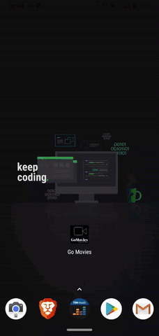

# Go Movies

#### Projeto de listagem de filmes desenvolvido para o desafio Mestres da WEB.

O Go Movies é um projeto que faz uma listagem eficientes dos filmes.

## Funconamento

O app utiliza a API do IMDB para pesquisar os filmes por *título* e ao retornar o resultado salva automaticamente no aparelho do usuário permitindo que o mesmo tenha acesso aos filmes pesquisados mesmo Offline. Há tambem um botão de atualização caso o usuário queira buscar os dados novamente da API, muito útil para acompanhar as avaliações de lançamentos.

## Tecnologias Utilizadas:

- React Native
- React Navigation
- Styled Components
- Hooks
- Typescript
- RealmDb
- Dotenv

## Demo da Aplicação:

<h4 align="center">
	<i>God is Beyond Everything</i>
</h4>
